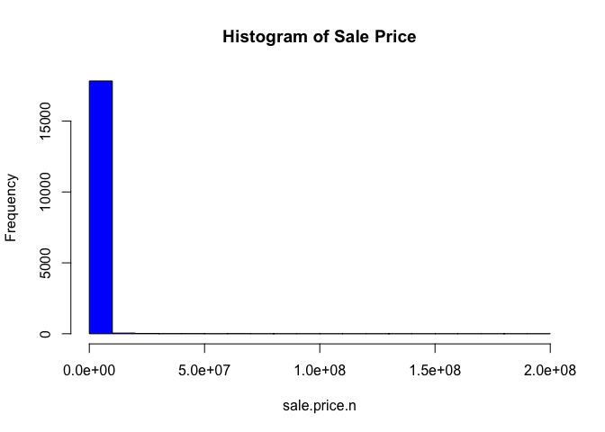
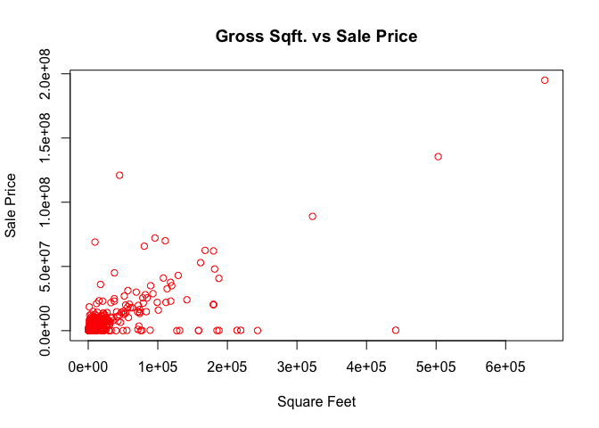
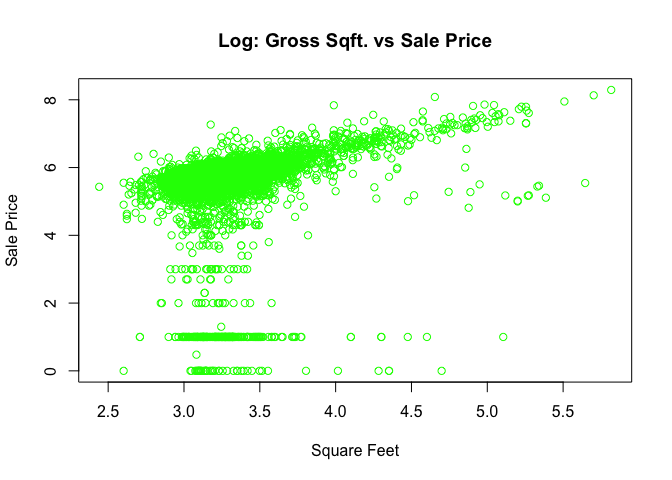
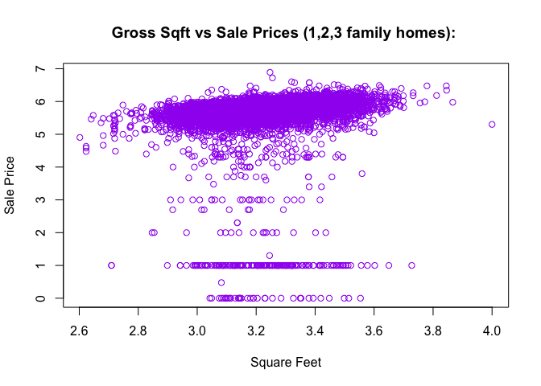
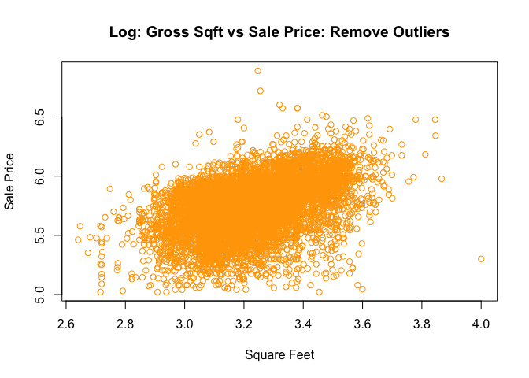

# Report -- Doing Data Science
**Group Members: Kenneth Avery, James Gage, Angela Horacek, Trace Smith**


#### Read Data into CSV

```r
bk <- read.csv("../Data/rollingsales_queens.csv",skip=4,header=TRUE)
```


```r
#### Check the data
head(bk)
```

```
##   BOROUGH              NEIGHBORHOOD
## 1       4 AIRPORT JFK              
## 2       4 AIRPORT LA GUARDIA       
## 3       4 AIRPORT LA GUARDIA       
## 4       4 AIRPORT LA GUARDIA       
## 5       4 AIRPORT LA GUARDIA       
## 6       4 AIRPORT LA GUARDIA       
##                        BUILDING.CLASS.CATEGORY TAX.CLASS.AT.PRESENT BLOCK
## 1 31  COMMERCIAL VACANT LAND                                      4 14260
## 2 01  ONE FAMILY DWELLINGS                                        1   976
## 3 01  ONE FAMILY DWELLINGS                                        1   976
## 4 02  TWO FAMILY DWELLINGS                                        1   976
## 5 03  THREE FAMILY DWELLINGS                                      1   949
## 6 03  THREE FAMILY DWELLINGS                                      1   949
##   LOT EASE.MENT BUILDING.CLASS.AT.PRESENT
## 1  70        NA                        V1
## 2  13        NA                        A5
## 3  61        NA                        A5
## 4  70        NA                        B1
## 5  15        NA                        C0
## 6  56        NA                        C0
##                                     ADDRESS APARTMENT.NUMBER ZIP.CODE
## 1 181-25 EASTERN ROAD                                           11430
## 2 21-16 81ST   STREET                                           11370
## 3 21-21 80TH   STREET                                           11370
## 4 21-03 80TH   STREET                                           11370
## 5 19-08 81ST   STREET                                           11370
## 6 19-69 80TH   STREET                                           11370
##   RESIDENTIAL.UNITS COMMERCIAL.UNITS TOTAL.UNITS LAND.SQUARE.FEET
## 1                 0                0           0         223,027 
## 2                 1                0           1           1,800 
## 3                 1                0           1           1,800 
## 4                 2                0           2           1,800 
## 5                 3                0           3           2,112 
## 6                 3                0           3           2,000 
##   GROSS.SQUARE.FEET YEAR.BUILT TAX.CLASS.AT.TIME.OF.SALE
## 1              -             0                         4
## 2            1,224        1950                         1
## 3            1,224        1950                         1
## 4            1,224        1950                         1
## 5            4,300        1985                         1
## 6            2,835        1945                         1
##   BUILDING.CLASS.AT.TIME.OF.SALE  SALE.PRICE SALE.DATE
## 1                             V1  7,800,000  1/14/2016
## 2                             A5    620,000  10/6/2015
## 3                             A5    660,000  7/26/2016
## 4                             B1        -    6/13/2016
## 5                             C0    940,000  4/14/2016
## 6                             C0        -    8/15/2016
```

#### Summary of Data

```r
summary(bk)
```

```
##     BOROUGH                     NEIGHBORHOOD  
##  Min.   :4   FLUSHING-NORTH           : 2617  
##  1st Qu.:4   FOREST HILLS             : 1089  
##  Median :4   BAYSIDE                  : 1074  
##  Mean   :4   ASTORIA                  : 1064  
##  3rd Qu.:4   JACKSON HEIGHTS          : 1013  
##  Max.   :4   FLUSHING-SOUTH           :  840  
##              (Other)                  :18102  
##                                  BUILDING.CLASS.CATEGORY
##  01  ONE FAMILY DWELLINGS                    :8173      
##  02  TWO FAMILY DWELLINGS                    :5559      
##  10  COOPS - ELEVATOR APARTMENTS             :3757      
##  13  CONDOS - ELEVATOR APARTMENTS            :1792      
##  03  THREE FAMILY DWELLINGS                  :1273      
##  09  COOPS - WALKUP APARTMENTS               :1218      
##  (Other)                                     :4027      
##  TAX.CLASS.AT.PRESENT     BLOCK            LOT         EASE.MENT     
##  1      :15079        Min.   :   13   Min.   :   1.0   Mode:logical  
##  2      : 7306        1st Qu.: 2754   1st Qu.:  15.5   NA's:25799    
##  4      : 1798        Median : 5938   Median :  39.0                 
##  2A     :  625        Mean   : 6638   Mean   : 203.2                 
##  1B     :  379        3rd Qu.:10088   3rd Qu.:  80.0                 
##  1A     :  375        Max.   :16322   Max.   :8007.0                 
##  (Other):  237                                                       
##  BUILDING.CLASS.AT.PRESENT
##  A1     : 3787            
##  D4     : 3757            
##  A5     : 2021            
##  B2     : 1867            
##  B3     : 1860            
##  R4     : 1768            
##  (Other):10739            
##                                       ADDRESS          APARTMENT.NUMBER
##  41-23 CRESCENT STREET                    :  152               :22763  
##  120 BEACH 26 STREET                      :  127   3B          :   54  
##  63-14 QUEENS BOULEVARD                   :   79   2B          :   50  
##  142-28 38TH   AVENUE                     :   74   3A          :   50  
##  106-20 70TH   AVENUE                     :   45   2A          :   49  
##  2 BAY CLUB DRIVE                         :   45   4A          :   43  
##  (Other)                                  :25277   (Other)     : 2790  
##     ZIP.CODE     RESIDENTIAL.UNITS COMMERCIAL.UNITS     TOTAL.UNITS      
##  Min.   :    0   Min.   :  0.000   Min.   :   0.0000   Min.   :   0.000  
##  1st Qu.:11360   1st Qu.:  0.000   1st Qu.:   0.0000   1st Qu.:   1.000  
##  Median :11375   Median :  1.000   Median :   0.0000   Median :   1.000  
##  Mean   :11300   Mean   :  1.593   Mean   :   0.1742   Mean   :   1.795  
##  3rd Qu.:11419   3rd Qu.:  2.000   3rd Qu.:   0.0000   3rd Qu.:   2.000  
##  Max.   :11697   Max.   :442.000   Max.   :2000.0000   Max.   :2000.000  
##                                                                          
##  LAND.SQUARE.FEET GROSS.SQUARE.FEET   YEAR.BUILT  
##   -     : 8405     -     : 9048     Min.   :   0  
##   4,000 : 1802     1,224 :  174     1st Qu.:1925  
##   2,500 : 1315     1,600 :  164     Median :1945  
##   2,000 : 1256     1,440 :  140     Mean   :1856  
##   3,000 :  649     1,280 :  137     3rd Qu.:1960  
##   1,800 :  443     1,200 :  128     Max.   :2016  
##  (Other):11929    (Other):16008                   
##  TAX.CLASS.AT.TIME.OF.SALE BUILDING.CLASS.AT.TIME.OF.SALE
##  Min.   :1.000             A1     : 3787                 
##  1st Qu.:1.000             D4     : 3756                 
##  Median :1.000             A5     : 2020                 
##  Mean   :1.526             B2     : 1868                 
##  3rd Qu.:2.000             B3     : 1858                 
##  Max.   :4.000             R4     : 1792                 
##                            (Other):10718                 
##      SALE.PRICE         SALE.DATE    
##   -       : 7875   1/20/2016 :  256  
##   10      :  208   4/5/2016  :  206  
##   450,000 :  156   2/29/2016 :  167  
##   400,000 :  141   6/30/2016 :  163  
##   600,000 :  141   10/29/2015:  153  
##   250,000 :  138   11/23/2015:  152  
##  (Other)  :17140   (Other)   :24702
```

#### Data Cleansing


```r
##"[^[:digit:]]" refers to members of the variable name that start with digits. 
#The gsub command to replace them with a blank space.
# We create a new variable that is a "clean' version of sale.price.
# And sale.price.n is numeric, not a factor.
bk$SALE.PRICE.N <- as.numeric(gsub("[^[:digit:]]","", bk$SALE.PRICE))
count(is.na(bk$SALE.PRICE.N))
```

```
##       x  freq
## 1 FALSE 17924
## 2  TRUE  7875
```


```r
names(bk) <- tolower(names(bk)) # make all variable names lower case
## Get rid of leading digits
bk$gross.sqft <- as.numeric(gsub("[^[:digit:]]","", bk$gross.square.feet))
bk$land.sqft <- as.numeric(gsub("[^[:digit:]]","", bk$land.square.feet))
bk$year.built <- as.numeric(as.character(bk$year.built))
```

#### Doing a bit of exploration to make sure everything appears correct

```r
attach(bk)
hist(sale.price.n,col="blue",main="Histogram of Sale Price") 
```

<!-- -->

```r
detach(bk)
```

#### Visualize the Data


```r
## keep only the actual sales
bk.sale <- bk[bk$sale.price.n!=0,]
plot(bk.sale$gross.sqft,bk.sale$sale.price.n,
     main="Gross Sqft. vs Sale Price", xlab="Square Feet", ylab="Sale Price",
     col="red",pch=1)
```

<!-- -->


```r
plot(log10(bk.sale$gross.sqft),log10(bk.sale$sale.price.n),
     main="Log: Gross Sqft. vs Sale Price", xlab="Square Feet", ylab="Sale Price",
     col="green",pch=1)
```

<!-- -->


```r
## for now, let's look at 1-, 2-, and 3-family homes
bk.homes <- bk.sale[which(grepl("FAMILY",bk.sale$building.class.category)),]
dim(bk.homes)
```

```
## [1] 10105    24
```

```r
plot(log10(bk.homes$gross.sqft),log10(bk.homes$sale.price.n),
     main="Gross Sqft vs Sale Prices (1,2,3 family homes): ",
     xlab="Square Feet", ylab="Sale Price",col="purple")
```

<!-- -->

```r
#summary(bk.homes[which(bk.homes$sale.price.n<100000),])
```


```r
## remove outliers that seem like they weren't actual sales
bk.homes$outliers <- (log10(bk.homes$sale.price.n) <=5) + 0
bk.homes <- bk.homes[which(bk.homes$outliers==0),]
plot(log10(bk.homes$gross.sqft),log10(bk.homes$sale.price.n),
     main="Log: Gross Sqft vs Sale Price: Remove Outliers",
     xlab="Square Feet", ylab="Sale Price",col="orange")
```

<!-- -->

#### Conclusion: 
After cleansing the data and removing potential outliers, we can clearly see that as the square footage of the house increases, so does the sales price. From the plots above, a linear relationship can be observed; meaning homes with higher square footage are of higher value and vise versa
